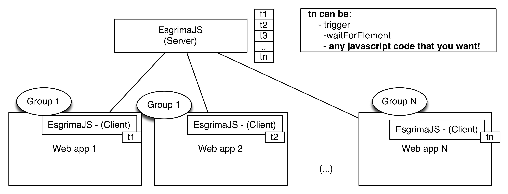

# JS Esgrima

## Do you need to do Javascript testing in multiple windows and screen?

## The problem

## How to use?

- [HowTo](docs/HOWTO.md)

## Are you able to integrate your code? Why are you create another test framework?

I'm running of time and I just have a weekend to built this tool.
Of course, I want to integrate it in another framework such as Karma, but
their phiolosofy is a bit different.

## Architecture

- [Pipeline](docs/Pipeline.md)
- [Communication](docs/Communication.md)

## Known issues

- Clock: how to syncrhonize the clock between several tests running?

# Inspiring & Authorship.

Many of the philosofy is taken from Karma. So kudos for Karma and for
Vojtech Jína, that are the author of the master thesis.

So, if somethins is not good with licenses or code or whatever, feel free
to let me know, and will fix it of course.
